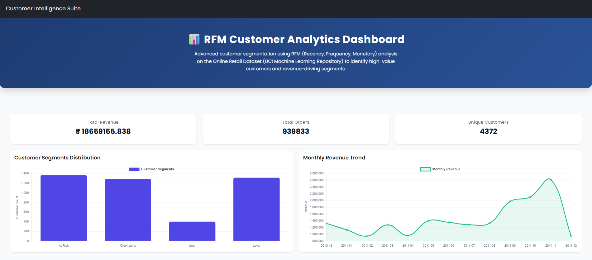
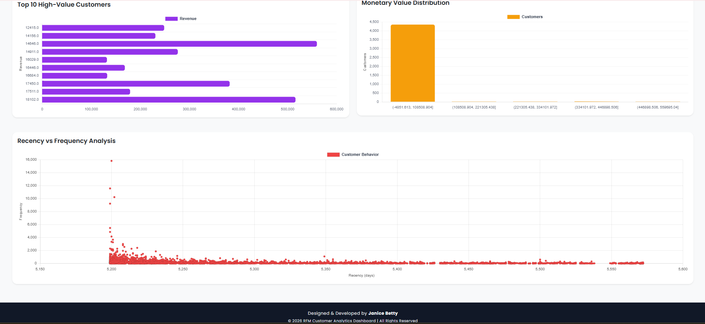

# 📊 RFM Dashboard

A simple single-page Flask dashboard that performs basic **RFM (Recency, Frequency, Monetary)** analysis and displays customer insights using 5 visualizations.

The application focuses on backend data processing and clean server-side rendering.

---

## 🚀 Overview

This project:

- Loads transactional data
- Computes Recency, Frequency, and Monetary metrics
- Generates RFM scores
- Displays multiple graphs on a single page
- Includes a simple header and footer layout

No multi-page routing. No complex frontend. Just backend-driven analytics.

---

## 📸 Preview

<p align="center">
  
</p>

<p align="center">
  
</p>

---

## 🧠 Backend Flow

1. Load dataset (`load_data.py`)
2. Compute RFM metrics (`rfm.py`)
3. Store / manage models (`models.py`)
4. Render visualizations through routes (`routes.py`)
5. Serve dashboard UI using templates

All processing is handled server-side using Pandas.

---

## 🛠️ Tech Stack

- Python
- Flask
- Pandas
- Matplotlib / Plotly
- SQLAlchemy / SQLite

---

## 📂 Project Structure

project_root/
│
├── flaskplot/
│ ├── data/
│ ├── static/
│ ├── templates/
│ ├── __init__.py
│ ├── config.py
│ ├── load_data.py
│ ├── models.py
│ ├── rfm.py
│ └── routes.py
│
├── run.py
├── requirements.txt
└── .gitignore

---

## ⚙️ Run Locally

```bash
git clone https://github.com/JaniceBetty/RFM-Analytics-Dashboard.git
cd RFM-Analytics-Dashboard

python -m venv venv
venv\Scripts\activate   # Windows

pip install -r requirements.txt
python run.py
```

---

## 📈 Dashboard Includes

- RFM Score Distribution
- Segment Distribution
- Monetary Analysis
- Frequency Analysis
- Recency Analysis

---

## Author

Janice Betty
